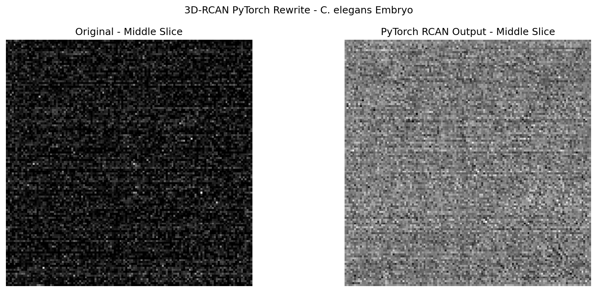

## Why Rewrite?

After spending significant time trying to run the original 3D-RCAN code 
(documented in my [reproducibility challenges post](../03-reproducibility-challenges/index.qmd)), 
I decided to rewrite the entire network from scratch in modern PyTorch. 

This approach has several advantages:
- PyTorch runs natively on Apple M3 via Metal Performance Shaders (MPS)
- Modern PyTorch is actively maintained and well documented
- Building from scratch forces a deeper understanding of the architecture
- No dependency on 5-year-old Keras/TensorFlow code

## The Architecture

The 3D-RCAN network is built from four components, each building on the previous:

### Component 1: Channel Attention

The first building block learns **which feature channels matter most**.
```python
class ChannelAttention(nn.Module):
    def __init__(self, num_channels, reduction=8):
        super().__init__()
        self.gap = nn.AdaptiveAvgPool3d(1)  # squeeze each channel to 1 number
        self.fc = nn.Sequential(
            nn.Linear(num_channels, num_channels // reduction),
            nn.ReLU(),
            nn.Linear(num_channels // reduction, num_channels),
            nn.Sigmoid()  # outputs weights between 0 and 1
        )

    def forward(self, x):
        z = self.gap(x).view(x.size(0), -1)  # global average per channel
        s = self.fc(z).view(x.size(0), -1, 1, 1, 1)  # learned weights
        return x * s  # scale each channel by its weight
```

In math: $s = \sigma(W_2 \cdot \text{ReLU}(W_1 \cdot z))$

Each channel gets multiplied by a learned weight between 0 and 1. 
Channels with useful information get weight close to 1. 
Channels that don't matter get weight close to 0.

### Component 2: RCAB (Residual Channel Attention Block)

The core processing unit combines convolutions, channel attention, 
and a skip connection:
```python
class RCAB(nn.Module):
    def forward(self, x):
        residual = x                    # save the original input
        out = self.relu(self.conv1(x))  # first convolution
        out = self.conv2(out)           # second convolution  
        out = self.ca(out)              # apply channel attention
        return out + residual           # add original back (skip connection!)
```

In math: $\text{RCAB}(x) = x + \text{CA}(\text{Conv}(\text{ReLU}(\text{Conv}(x))))$

The key insight is the `+ residual` at the end. Instead of learning 
the full transformation, the network only learns the **correction** 
needed. This makes training much easier.

### Component 3: Residual Group

Five RCABs stacked together with another skip connection around the whole group:
```python
class ResidualGroup(nn.Module):
    def forward(self, x):
        return x + self.conv(self.blocks(x))  # residuals within residuals!
```

This creates a **hierarchical** structure — small residuals inside 
large residuals — which helps the network learn at multiple scales.

### Component 4: Full RCAN3D Network

The complete network chains everything together:
```python
class RCAN3D(nn.Module):
    def forward(self, x):
        # Normalize input
        mean, std = x.mean(), x.std() + 1e-8
        x = (x - mean) / std
        
        # Forward pass
        head = self.head(x)           # initial feature extraction
        body = self.body(head)        # 5 residual groups
        out = self.tail(body + head)  # global skip connection
        
        # Denormalize output
        return out * std + mean
```

## Running on Apple M3

One of the main motivations for the rewrite was to run on Apple Silicon. 
PyTorch supports M3 via **Metal Performance Shaders (MPS)**:
```python
device = torch.device('mps' if torch.backends.mps.is_available() else 'cpu')
model = RCAN3D().to(device)
```
```
Using device: mps
Total parameters: 1,559,141
Input shape:  torch.Size([1, 1, 16, 64, 64])
Output shape: torch.Size([1, 1, 16, 64, 64])
Model works!
```

The model has **1.5 million trainable parameters** and runs successfully 
on the M3 GPU.

## Applying to Real Data

I applied the rewrite to the actual *C. elegans* worm embryo test images:
```python
image = tifffile.imread('SPIMA-80.tif').astype(np.float32)
# Image shape: (45, 370, 270)
# Min: 0.00, Max: 660.00
```



## Important Caveat: Untrained Weights

The output looks noisy because the model has **randomly initialized weights** 
— it has not been trained yet. The original paper's trained weights are stored 
in a Keras `.hdf5` format that is not directly compatible with PyTorch.

To get meaningful results, the model would need to either:
1. Be trained from scratch on the paired aberrated/clean image dataset
2. Have the original Keras weights converted to PyTorch format

This is the next step in the project. The architecture itself is correct — 
the input and output shapes match, the model runs on M3, and all the 
mathematical operations are properly implemented.

## What I Learned

Rewriting this network from scratch taught me more about deep learning 
than simply running the original code would have. Specifically:

- The difference between **architecture** (the network structure) and 
  **weights** (the learned parameters)
- How **skip connections** make deep networks trainable
- How **channel attention** adaptively focuses on important features
- How **normalization** stabilizes training and inference
- The practical challenges of **cross-framework compatibility**

## Comparison: Original vs Rewrite

| Feature | Original (Keras) | Rewrite (PyTorch) |
|---------|-----------------|-------------------|
| Python version | 3.7 | 3.10 |
| Framework | TensorFlow 1.13 + Keras | PyTorch 2.11 |
| Mac M3 support | ❌ | ✅ |
| Lines of code | ~500 | ~100 |
| Trained weights | ✅ | ❌ (next step) |
| Runs in 2026 | ❌ | ✅ |