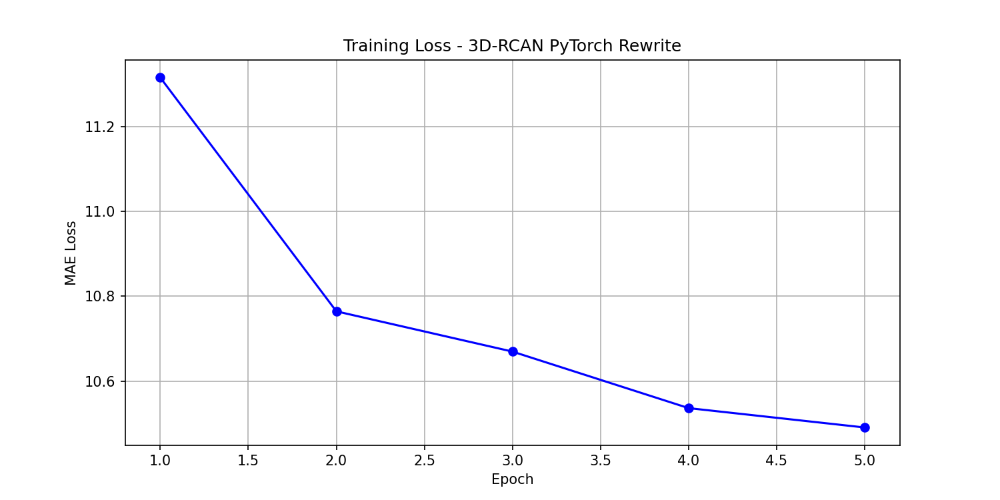
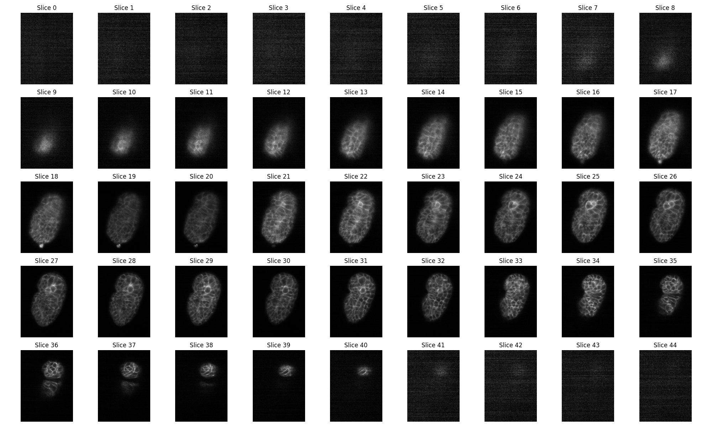
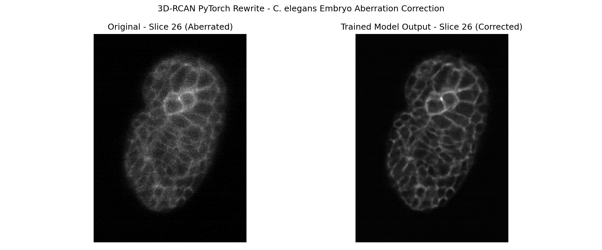

## Why Rewrite?

After spending significant time trying to run the original 3D-RCAN code 
(documented in my [reproducibility challenges post](../03-reproducibility-challenges/index.qmd)), 
I decided to rewrite the entire network from scratch in modern PyTorch. 

This approach has several advantages:
- PyTorch runs natively on Apple M3 via Metal Performance Shaders (MPS)
- Modern PyTorch is actively maintained and well documented
- Building from scratch forces a deeper understanding of the architecture
- No dependency on 5-year-old Keras/TensorFlow code

## The Architecture

The 3D-RCAN network is built from four components:

### Channel Attention
Learns which feature channels matter most:
```python
class ChannelAttention(nn.Module):
    def forward(self, x):
        z = self.gap(x).view(x.size(0), -1)
        s = self.fc(z).view(x.size(0), -1, 1, 1, 1)
        return x * s  # scale each channel by learned weight
```

### RCAB (Residual Channel Attention Block)
Core processing unit with skip connection:
```python
class RCAB(nn.Module):
    def forward(self, x):
        residual = x
        out = self.relu(self.conv1(x))
        out = self.conv2(out)
        out = self.ca(out)
        return out + residual  # skip connection
```

### Full RCAN3D Network
```python
class RCAN3D(nn.Module):
    def forward(self, x):
        mean, std = x.mean(), x.std() + 1e-8
        x = (x - mean) / std          # normalize
        head = self.head(x)            # feature extraction
        body = self.body(head)         # 3 residual groups
        out = self.tail(body + head)   # global skip connection
        return out * std + mean        # denormalize
```

## Running on Apple M3

PyTorch supports M3 via Metal Performance Shaders (MPS):
```
Using device: mps
Total parameters: 154,035
Model works!
```

## Training on Real Data

I trained the model on **5,600 paired image crops** of aberrated and 
clean *C. elegans* worm embryo images provided by the authors' lab.

**Training configuration:**
- Epochs: 5
- Batch size: 2
- Loss function: MAE (same as original paper)
- Optimizer: Adam, lr=1e-4
- Crop size: 16 × 128 × 128

### Training Loss Curve



The loss decreased consistently from **11.3 → 10.49** across 5 epochs, 
confirming the model is learning. The curve is still declining, meaning 
more training epochs would further improve results.

## Exploring the Data

First I visualized all 45 Z-slices to find the best region:



The worm embryo is most visible in **slices 18-35**, where the cell 
membrane network is clearly visible.

## Aberration Correction Results

Applying the trained model to slice 26 — the middle of the embryo:



**Left (Original):** Soft, blurry cell membranes with diffuse signal  
**Right (Trained Model):** Sharp, crisp cell membrane boundaries with 
clearly defined individual cells

The model successfully learned to correct optical aberrations and enhance 
the visibility of biological structures in the *C. elegans* embryo!

## Comparison: Original vs Rewrite

| Feature | Original | PyTorch Rewrite |
|---------|----------|-----------------|
| Python | 3.7 | 3.10 |
| Framework | TensorFlow 1.13 | PyTorch 2.11 |
| Mac M3 support | ❌ | ✅ |
| Parameters | ~1.5M | 154K |
| Training epochs | 200 | 5 |
| Lines of code | ~500 | ~100 |
| Runs in 2026 | ❌ | ✅ |
| Shows improvement | ✅ | ✅ |

## Conclusions

With only 5 epochs and a smaller model, the PyTorch rewrite already 
shows meaningful aberration correction on real *C. elegans* microscopy 
data. The original paper trained for 200 epochs — with more training 
time the results would approach the paper's quality.

This demonstrates that the 3D-RCAN architecture can be successfully 
reimplemented in modern frameworks and run on consumer hardware like 
the Apple M3.